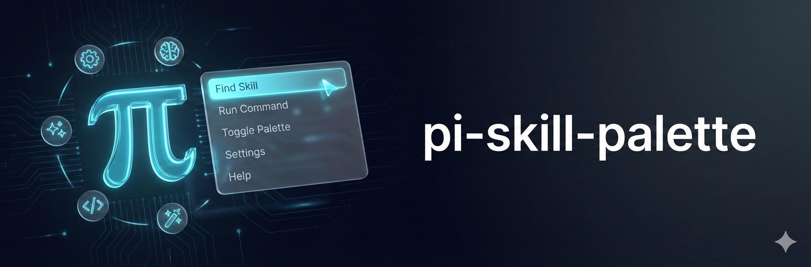

<p>
  
</p>

# Pi Skill Palette

A command palette for [Pi coding agent](https://github.com/badlogic/pi) that lets you explicitly select which skill to inject with your next message.

```
/skill
```


## Why

Agents don't always know when to read their skills. Instead of relying on automatic detection based on task context, this extension gives you direct control. Select a skill from the palette and it gets sent alongside your next message.

## Install

```bash
pi install npm:pi-skill-palette
```

Restart pi to load the extension.

## Quick Start

1. Type `/skill` and press Enter
2. Start typing to fuzzy-filter skills
3. Use `↑`/`↓` to navigate, `Enter` to select
4. Send your message - the skill context is automatically included

The selected skill appears in the footer and a widget until consumed. Re-select a queued skill to unqueue it (with confirmation).


## Keyboard Shortcuts

| Key | Action |
|-----|--------|
| `↑` / `↓` | Navigate skills |
| `Enter` | Select / Unqueue skill |
| `Esc` | Cancel |
| `Tab` | Switch buttons (in confirmation dialog) |
| `Y` / `N` | Quick confirm/cancel unqueue |

## Skill Locations

Skills are loaded from these directories (in order):

1. `~/.codex/skills/` - Codex user skills (recursive)
2. `~/.claude/skills/` - Claude user skills (one level deep)
3. `.claude/skills/` - Claude project skills (one level deep)
4. `~/.pi/agent/skills/` - Pi user skills (recursive)
5. `~/.pi/skills/` - Legacy user skills (recursive)
6. `.pi/skills/` - Pi project-specific skills (recursive)

Each skill must be in its own directory with a `SKILL.md` file containing YAML frontmatter:

```markdown
---
name: my-skill
description: Brief description of what this skill does
---

# Skill Content

The actual skill instructions go here...
```

## Theming

Customize colors by creating `theme.json` in the extension directory. Copy `theme.example.json` as a starting point:

```bash
cp theme.example.json theme.json
```

Theme values are ANSI SGR codes (`"36"` for cyan, `"2;3"` for dim+italic, `"38;2;215;135;175"` for RGB).

| Property | Description |
|----------|-------------|
| `border` | Box borders |
| `title` | Title text |
| `selected` | Selection indicator |
| `selectedText` | Selected item text |
| `queued` | Queued badge |
| `searchIcon` | Search icon |
| `placeholder` | Placeholder text |
| `description` | Skill descriptions |
| `hint` | Footer hints |
| `confirm` | Confirm button |
| `cancel` | Cancel button |

## How It Works

When you select a skill, it's queued in memory with visual indicators in the footer and widget. On your next message, the skill content is sent via the `before_agent_start` extension event as a custom message alongside your prompt. Skills are deduplicated by name (first occurrence wins) and symlinks are followed when scanning directories.

## Limitations

- Skills are loaded once at startup (restart pi to pick up new skills)
- Theme changes require a restart
- First occurrence wins when skills share the same name across directories
