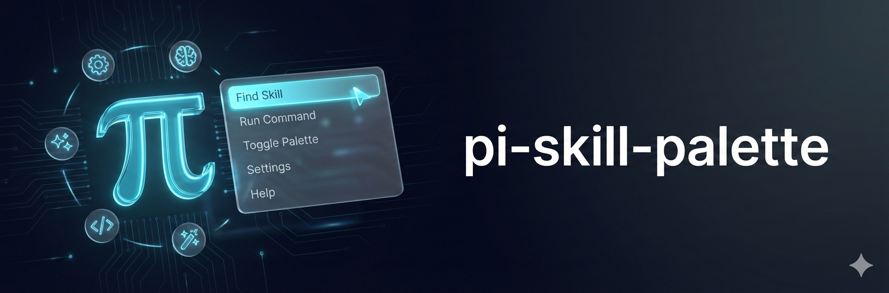

<p>
  
</p>

# Pi Skill Palette

A command palette for [Pi coding agent](https://github.com/earendil-works/pi) that lets you explicitly select up to three skills to inject with your next message.

```
/skill
```


## Why

Agents don't always know when to read their skills. Instead of relying on automatic detection based on task context, this extension gives you direct control. Select a skill from the palette and it gets sent alongside your next message.

## Install

```bash
pi install npm:pi-skill-palette
```

Restart pi to load the extension.

## Compatibility

This package includes an [Agent Plugins](https://agent-plugins.org/) v1.0.0 `plugin.json` manifest for portable package metadata. Runtime behavior remains Pi-specific through `package.json` and `index.ts`. The package does not expose portable `skills/` or `mcp.json` components.

## Quick Start

1. Type `/skill` and press Enter
2. Start typing to fuzzy-filter skills
3. Use `↑`/`↓` to navigate, `Enter` to select
4. Send your message - the queued skill context is automatically included

You can queue up to three different skills. Run `/skill` again to add another skill. The queued skills appear in the footer and widget until consumed. Re-select a queued skill to unqueue it (with confirmation).

## Multi-skill Commands

You can also load multiple skills with Pi's `/skill:` syntax:

```bash
/skill:typescript-code,/skill:react-best-practices build this component
/skill:typescript-code,react-best-practices,frontend-design build this component
```

The extension accepts up to three different skills. If you omit the prompt, the skills are queued for your next message.

## Keyboard Shortcuts

| Key | Action |
|-----|--------|
| `↑` / `↓` | Navigate skills |
| `Enter` | Select / Unqueue skill |
| `Esc` | Cancel |
| `Tab` | Switch buttons (in confirmation dialog) |
| `Y` / `N` | Quick confirm/cancel unqueue |

## Skill Locations

The palette shows the skills already loaded by pi for the current session, including user skills, trusted project skills, configured skill paths, and installed package skills. This keeps the palette aligned with pi's own discovery, precedence, trust, and deduplication rules.

Each skill must provide YAML frontmatter:

```markdown
---
name: my-skill
description: Brief description of what this skill does
---

# Skill Content

The actual skill instructions go here...
```

## Theming

Customize colors by creating `theme.json` in the extension directory. Copy `theme.example.json` as a starting point:

```bash
cp theme.example.json theme.json
```

Theme values are ANSI SGR codes (`"36"` for cyan, `"2;3"` for dim+italic, `"38;2;215;135;175"` for RGB).

| Property | Description |
|----------|-------------|
| `border` | Box borders |
| `title` | Title text |
| `selected` | Selection indicator |
| `selectedText` | Selected item text |
| `queued` | Queued badge |
| `searchIcon` | Search icon |
| `placeholder` | Placeholder text |
| `description` | Skill descriptions |
| `hint` | Footer hints |
| `confirm` | Confirm button |
| `cancel` | Cancel button |

## How It Works

When you select a skill, it's queued in memory with visual indicators in the footer and widget. On your next message, all queued skill content is sent via the `before_agent_start` extension event as a custom message alongside your prompt. The palette uses pi's loaded skill list, so skill precedence, trust checks, package resources, configured paths, and deduplication are handled by pi.

## Limitations

- Use `/reload` or restart pi to pick up newly added skills
- Theme changes require a restart
